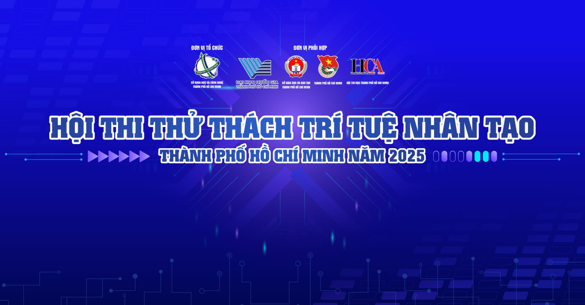

<p align="center">
  
</p>

## 🤖 LLM Video Retriever

## 🚀 Hướng dẫn chạy project

### 1. 🌱 Clone dự án
```bash
git clone https://github.com/m1nhpham2k4/AIC_Test.git
cd AIC_Test
```

### 2. 🐍 Kích hoạt môi trường ảo (virtual environment)

#### Nếu chưa có môi trường ảo:
```bash
python -m venv venv
```

#### Kích hoạt môi trường:
- **Windows**:
  ```bash
  venv\Scripts\activate
  ```
- **macOS/Linux**:
  ```bash
  source venv/bin/activate
  ```

### 3. 📦 Cài đặt thư viện cần thiết
```bash
pip install -r requirements.txt
```

### 4. 🚦 Chạy FastAPI server
```bash
uvicorn app.main:app --reload
```

> Truy cập giao diện tại: [http://127.0.0.1:8000](http://127.0.0.1:8000)
